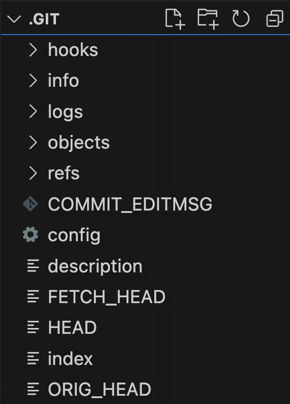
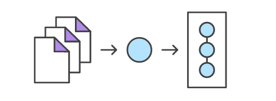

# Hi Git by Mariam

## Outline

    -git config basics
    -creating a new repo
    -first commit (BATMAN) (add - commit -m)
    -git status
    -git log with options (--graph --online) ✨

### git config basics

1. such as any program has its setting in git we can set/get our configuration locally or globally
2. the meaning of global is that all the reports can see this configuration / unlike local your current repo can see it only
3. let's see what are the configuration we can use and its structure

```
<section>.<key>
```
first, get a list of git configurations:

```
git config --list
git config -l
```

**to get a specific configuration**:

    git config --global <section>.<key>

```

git config --global user.name
git config --global user.email

```

how to set it 😊: the same code just add value

```
git config --global user. name "Mariam"
```

finally to delete that configuration 🗑️:

```

git config --global --unset user.name

```

>[!NOTE]
> The first time using installing git you should set your config user.name user.email✔️

### Create a new repo
I think that all of us know how to create a new repo so I'll go throw it quickly
```
mkdir myRepo
cd myRepo
git init
```

question: what does **git init** do ?\
it just gets the hidden folder  **.git**

**.git**\
contains all of the information that Git needs to track changes to your codebase




> [!WARNING]
> If you deleted the  .git folder by mistake you deleted the repo😦.

### first commit (BATMAN)
know we have created our repo suppose you worked in it and now you need to save your work \
we can translate our meaning of **saving our work** to **git add**->> **git commit**


**git add**\
As we explained before what is the tracked file and staging area any changed file at the beginning is untracked.
```
git add [file name]
git add .
git add *
```

**Commit**\
Commits are the core building block units of a Git project timeline. Commits can be thought of as snapshots or milestones along the timeline of a Git project\
commits like a tree every commit has its parent




**let's make our first commit**

```
echo BATMAN >>README.md
git add .
git commit -m "BATMAN"
```


### git status
displays the state of the working directory and the staging area. It lets you see which changes have been staged, which haven’t, and which files aren’t being tracked by Git

```
git status
```

### git log
displays committed snapshots. It lets you list the project history, filter it, and search for specific changes.

```
git log
```

**question: is there another way to see command more clearly?**\
creates a graphic overview of how it has branched and merged over time😲

```
git log --graph
git log --graph --oneline
```


#### Code Summery

```
git config --list
git config -l
git config --global user.name
git config --global user.email
git config --global user. name "Mariam"
git config --global --unset user.name
mkdir myRepo
cd myRepo
git init
echo BATMAN >>README.md
git add .
git commit -m "BATMAN"
mkdir newFolder
git status
git add newFolder
git commit -m "new Folder"
git log
git log --graph
git log --graph --oneline
```