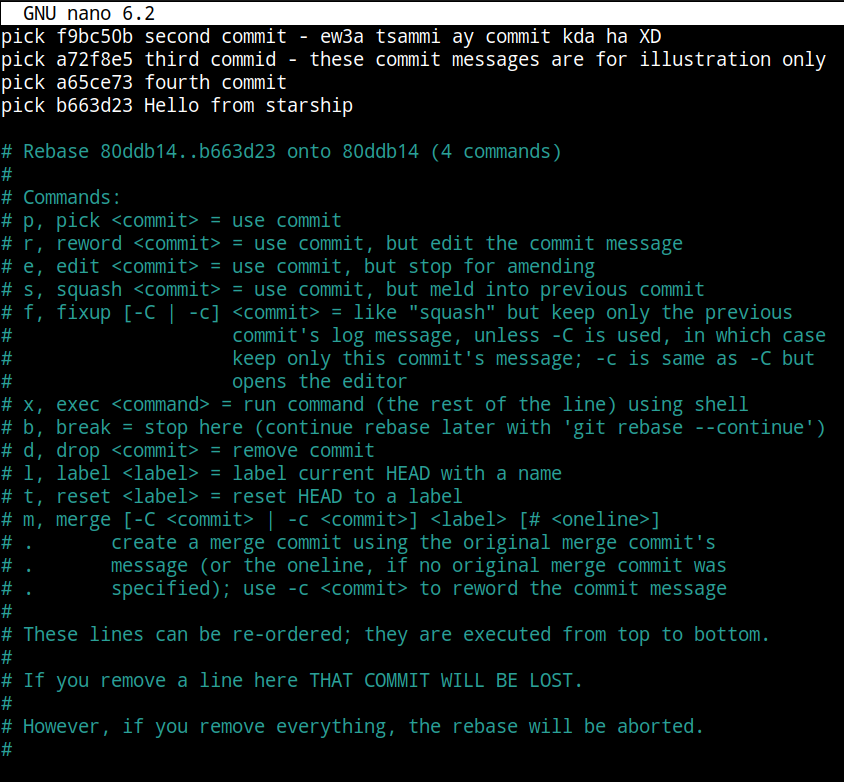
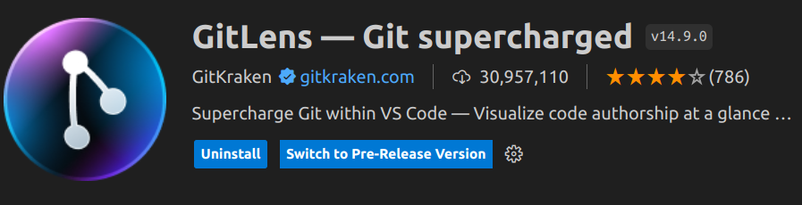
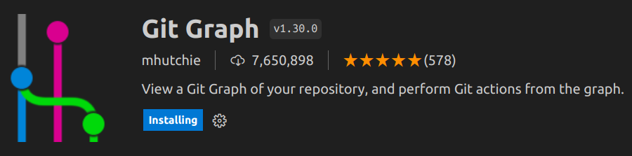
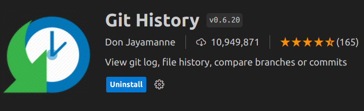
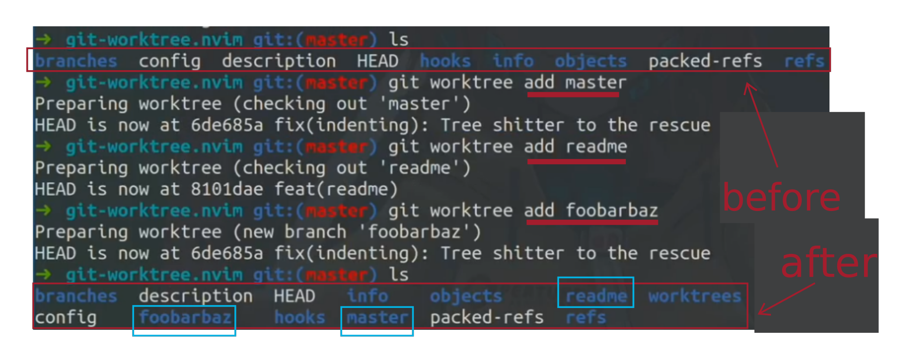
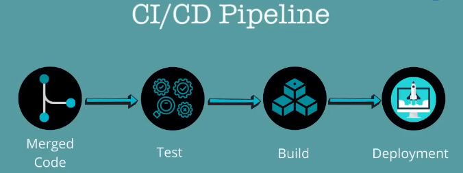

# {A} Fancy Git Commands

## {1} `git commit --amend `
_something like editing the last message in whatsapp_ <br>
sometimes you make a minor mistake in the last commit, (last commit only) <br>
something like forgetting to add a file or an immediate mistake<br>
so instead of making another commit with message _"minor edit"_ or _"fix typo"_ <br>
USE git commit --amend <br>
amend means adjust / modify

```bash
git commit --amend -m "updated commit message"
# this simply takes the currently staged changes (if any) and put it in the last commmit,
# and updates its message
```
OR
```bash
git commit --amend --no-edit
# this simply takes the currently staged changes and put it in the last commmit
# leaving the message as it is
```
- <a href="https://www.atlassian.com/git/tutorials/rewriting-history#:~:text=Changing%20the%20Last%20Commit%3A%20git,creating%20an%20entirely%20new%20commit.">Reading Docs</a>

- [YouTube Playlist - Great source](https://youtube.com/playlist?list=PLfU9XN7w4tFzW200TaCP1W9RTE8jRSHU5&si=l7Rlfs2JWvgHhnb-)


## {2} `git rebase -i `
### What if I want a commit that is further back ?
### {2.1} Reword
example: 
` git rebase -i HEAD~2 ` <br>
means I want to work on the last 2 commits <br>
this will open vim or nano. allowing you to do a lot of stuff, of which is "reword" <br>
type "reword" instead of pick in front of the commit that you want to change its message. <br>
` Esc  :  W  Q` in vim or `^S ^X` in nano<br> 
when you hit enter, you get directed to another window to edit the commit message that you intended




### {2.2} Reorder
_refer to the image_ <br>
Just change the order in which they appear (top is the current oldest) 

### {2.3} Squash (combine commits)
_refer to the image_ <br>
Simply combining multiple commits into one
#### Squash vs Fixup
The difference is in the commit message, anyways the commit bodies are combined


## {3} Stash
save a draft of current changes, and REVERT the current working directory to a clean slate.
* Staged but Uncommitted changes are pushed onto the stash
* The files are now similar to HEAD, the last commit

#### common routine:
```bash
# stage all changes
git add . 
# put them away for now
git stash -m "cool stassshh" 
# get remote changes
git pull 
# may produce conflict
git stash pop 
..
# then make your commits / solve conflicts
..
git stash drop  # to delete one
git stash clear # to delete all
```


## {4} Revert & Reset
### {4.1} Revert _(correct the mistake)_
```bash
# this creates a commit inverse to the last commit. 
git revert HEAD
# with default message being : Revert "<message of last commit>"
```
> equivalent to Ctrl + Z <br>
(but another commit is created on top of the last one!)
### {4.2} Reset _(erase the mistake)_
Before:
```bash
$ git log --oneline
e2f9a78 Revert "Try something crazy"
872fa7e Try something crazy
a1e8fb5 Make some important changes to hello.txt
435b61d Create hello.txt
9773e52 Initial import
```
After:
```bash
$ git reset --hard a1e8fb5
a1e8fb5 Make some important changes to hello.txt
435b61d Create hello.txt
9773e52 Initial import
```
> Rule of thumb: Use reset for local Undo's, Use revert for public Undo's

## {5} Tags & Releases
<a href="https://git-scm.com/book/en/v2/Git-Basics-Tagging">Reference</a>

### {5.1} Tags (name a checkpoint)

> Tags are ref's that point to specific points in Git history. Tagging is generally used to capture a point in history that is used for a marked version release (i.e. v1.0.1).

 >Tag is a pointer to a specific commit. This pointer can be super charged with some additional information (identity of the creator of the tag, a description, a GPG signature, ...).


```bash
# to create a new tag
git tag -a v1.0 -m "first version"

# v1.0 is just an example to work on the following too

# to list all tags
git tag

# to view info of specific tag
git show v1.0

# to delete a tag
git tag -d v1.0
```

### {5.2} Releases (in GitHub: you can download my project)

> A Release is created from an existing tag and exposes release notes and links to download the software or source code from GitHub.

>**A tag is a git concept whereas a Release is GitHub higher level concept.**

> "Releases are first-class objects with changelogs and binary assets that present a full project history beyond Git artifacts."

# {B} More Tools
## {1} Lazy Git

- Makes interaction with git much faster<br>
- a keyboard shortcut for each git command
- quick preview for diffs and git status

- <a hrerf="https://github.com/jesseduffield/lazygit">Open source prject repo</a> <br>
- <a href="https://youtu.be/CPLdltN7wgE?si=n3y-ht-l03CZV2v7"> Video Tutorial from its creator</a><br>
- <a href="https://youtu.be/tDOxm4P3udo?si=bpD8yKQQpwg0sFJQ"> Another One for beginners</a>

### Honorable mentions VS Code extensions

## {2} WorkTrees
- If you would like to work on multiple branches at the same time<br>
- Without worktrees you would need to commit or at least stash your current changes on your current branch, then checkout to the other branch and do what you need,<br>
- then come back and unstash your previous changes ..
- Worktrees offer a simpler approach.
- You can have multiple branches checked out at the same time
- (Each folder can represent a different branch)
- `git clone --bare <url>` the keyword is **--bare**
- `git worktree add <branchname>` creates a folder which contains the given branch checked out
- when you need to switch branches you can just `cd` into the folder you want !
- <a href="https://youtu.be/2uEqYw-N8uE?si=mklxnEDOwkhQjzct">Primagen Tutorial</a>

## {2} Workflows and how GitHub actions automate them

- AUTOMATING building, testing and deployment

- configure automatic actions that are executed when something happens to your repo
1. Listen to event
    - events like: PR created, Merged a feature, Issue created, Contributor joined
2. Trigger workflow (a sequence of actions)
    - actions like: run tests, build, run linter, publish, send notifications containing results

[Github actions](https://youtu.be/R8_veQiYBjI?si=vtBa8fbBcYArxT24)
