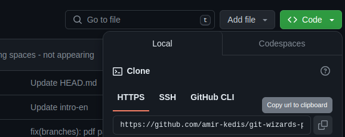

# Git remote

## What’s a remote?

remote doesn’t necessarly mean using github..it may be a remote repo on your local machine too (COPY OF THE MAIN REPO SOMEWHERE ELSE).

• A remote is just another git repo that is of the same project and has changes we may need.

## git vs github

Now all these wonderful stuffs are on your local machine..How to share it with others?

**Use github (ONLINE BACKUP)**🤩

To link your local repo with a remote one:

```bash
**git init
git remote add <remote-name> <url>**
```

or simply



```bash
**git clone <uri> <folder-name>**
```

this will create a folder with git initialized in it

## git fetch

assume you’re in a case that your team mate added some features to the code and pushed it to the repo..how can you get these changes?

HERE is where git fetch comes to play😍

```bash
git fetch
```

```bash
git branch -a
```

Updates all remote tracking branches. Remote
tracking branches (like origin/main) show what
the branch looks like in the remote repository

you’ll notice you’ve all the branches that are in the remote repo

`wait what?!..Where is the update?!`

**Here's what happens when you run** **`git fetch`**:

1. Git contacts the remote repository.
2. It retrieves any new commits, branches, or tags that exist on the remote repository but are not present in your local repository.
3. It updates your local repository's remote-tracking branches (e.g., **`origin/main`**) to reflect the state of the remote repository.

**However, the command does not:**

- Change the state of your current working branches.
- Merge any changes into your local branches.
- Modify any of your local files or commit history.

> **In summary:** fetch is used to update all of the remote tracking branches as they are not updated automatically

## git pull

```bash
**git pull <remote> <branch>**
```

use it to merge the remote changes into your local branches

## git push

It’s now the case that you want to upload your changes to the remote repo

```bash
**git push <remote> <branch>**
```

## merge conflicts

you created a commit..changed a certain line of code

your teamate created a commit..changed the same line of code

git doesn’t know what change it should accept and needs your help🥺

create a commit where the 1st line of [readme.md] in local repo contains

`Hello from local`

and a commit where the same line is `Hello from remote` in the remote repo

then pull the updates in the local repo

```bash
**asmaa@asmaa:~/Desktop/local$** git pull origin main
remote: Enumerating objects: 5, done.
remote: Counting objects: 100% (5/5), done.
remote: Total 3 (delta 0), reused 0 (delta 0), pack-reused 0
Unpacking objects: 100% (3/3), 241 bytes | 241.00 KiB/s, done.
From /home/asmaa/Desktop/./github
 * branch            main       -> FETCH_HEAD
   793948b..3481fb2  main       -> origin/main
Auto-merging readme.md
CONFLICT (content): Merge conflict in readme.md
Automatic merge failed; fix conflicts and then commit the result.
```

**opps..you see this:**

CONFLICT (content): Merge conflict in readme.md
Automatic merge failed; fix conflicts and then commit the result.

```bash
**asmaa@asmaa:~/Desktop/local$** git status
On branch main
You have unmerged paths.
  (fix conflicts and run "git commit")
  (use "git merge --abort" to abort the merge)

Unmerged paths:
  (use "git add <file>..." to mark resolution)
	both modified:   readme.md

no changes added to commit (use "git add" and/or "git commit -a")
```

**And this:**

both modified: readme.md

**lets see what is in [readme.md]**

```bash
<<<<<<< HEAD
Hello from local
=======
Hello from remote.
>>>>>>> 3481fb2d429347f009646b1456375e6685c1a36e

```

<<<<<<< HEAD
Hello from local
=======

**this simply tells you that your version has these changes**

=======
Hello from remote.

> > > > > > > 3481fb2d429347f009646b1456375e6685c1a36e

**and the remote has these changes**

It is your mission to either:

- accept your changes
- accept the remote changes
- combine both
- add completely new line

_Accepting the remote changes…_

```bash
**asmaa@asmaa:~/Desktop/local$** git add .
**asmaa@asmaa:~/Desktop/local$** git status
On branch main
All conflicts fixed but you are still merging.
  (use "git commit" to conclude merge)

Changes to be committed:
	modified:   readme.md

**asmaa@asmaa:~/Desktop/local$** git commit -m "merge conflict resolved"
[main 97b09b2] merge conflict resolved
```
